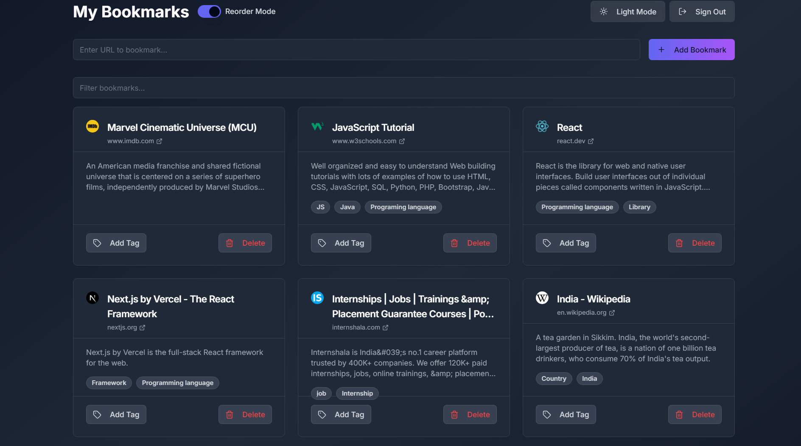
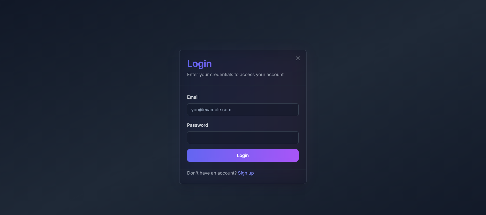
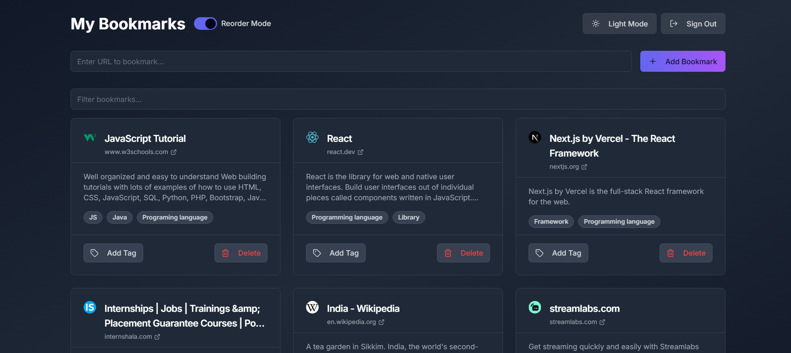
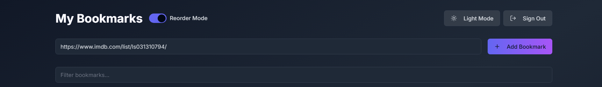
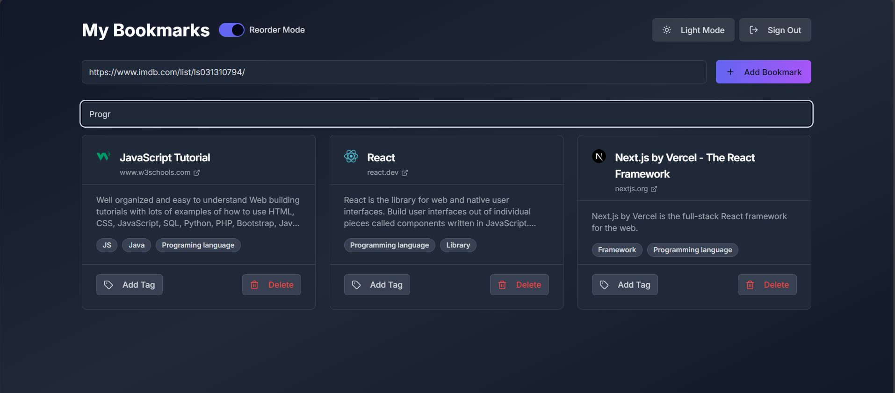

# BookmarkAI - Smart Bookmark Manager

BookmarkAI is a full-stack web application that allows users to save, organize, and automatically summarize their bookmarks. The application extracts metadata from bookmarked websites and uses Jina AI to generate summaries.

## Features

- **User Authentication**: Secure email/password authentication using Supabase Auth
- **Bookmark Management**: Save, view, and delete bookmarks
- **Automatic Metadata Extraction**: Extracts title, favicon, and summary from bookmarked websites
- **AI-Powered Summaries**: Uses Jina AI to generate summaries of bookmarked content
- **Tagging System**: Add and filter bookmarks by tags
- **Drag-and-Drop Reordering**: Reorder bookmarks with intuitive drag-and-drop
- **Dark Mode**: Toggle between light and dark themes
- **Responsive Design**: Works on desktop and mobile devices
- **Offline Support**: Stores bookmarks in localStorage for offline access

## Tech Stack

### Frontend
- **Next.js**: React framework for server-rendered applications
- **React**: JavaScript library for building user interfaces
- **Tailwind CSS**: Utility-first CSS framework
- **shadcn/ui**: High-quality UI components built with Radix UI and Tailwind
- **react-beautiful-dnd**: Library for drag-and-drop functionality

### Backend
- **Next.js API Routes**: Serverless functions for backend logic
- **Supabase**: Backend-as-a-Service for authentication and database

### Data Storage
- **Supabase PostgreSQL**: Primary database for production
- **localStorage**: Client-side storage for offline functionality and demo purposes

### External APIs
- **Jina AI**: Used for generating summaries of bookmarked content

## Setup Instructions

### Prerequisites
- Node.js (v14 or later)
- npm or yarn
- Supabase account (free tier works fine)

### Installation

1. Clone the repository:
   \`\`\`bash
   git clone https://github.com/meCeltic/Bookmark-AI
   cd bookmark-ai
   \`\`\`

2. Install dependencies:
   \`\`\`bash
   npm install
   # or
   yarn install
   \`\`\`

3. Set up environment variables:
   Create a `.env.local` file in the root directory with the following variables:
   \`\`\`
   NEXT_PUBLIC_SUPABASE_URL=your_supabase_url
   NEXT_PUBLIC_SUPABASE_ANON_KEY=your_supabase_anon_key
   SUPABASE_URL=your_supabase_url
   SUPABASE_ANON_KEY=your_supabase_anon_key
   SUPABASE_SERVICE_ROLE_KEY=your_supabase_service_role_key
   \`\`\`

4. Set up the database:
   Run the SQL script in `setup-database.sql` in your Supabase SQL editor to create the necessary tables and policies.

5. Run the development server:
   \`\`\`bash
   npm run dev
   # or
   yarn dev
   \`\`\`

6. Open [http://localhost:3000](http://localhost:3000) in your browser to see the application.

## Testing

Run the test suite with:

\`\`\`bash
npm test
# or
yarn test
\`\`\`

For watch mode during development:

\`\`\`bash
npm run test:watch
# or
yarn test:watch
\`\`\`

## What I'd Do Next

Given more time, I would implement the following features and improvements:

1. **Bookmark Export/Import**: Allow users to export their bookmarks as JSON and import them back.
2. **Browser Extension**: Create a Chrome/Firefox extension for quick bookmarking from any page.
3. **Collections/Folders**: Add the ability to organize bookmarks into collections or folders.
4. **Advanced Tag Management**: Create a dedicated interface for managing and organizing tags.
5. **Full-Text Search**: Implement search functionality that includes the content of summaries.
6. **Improved Error Handling**: Add more robust error handling and user feedback.
7. **Performance Optimizations**: Implement pagination and lazy loading for large bookmark collections.
8. **Collaborative Features**: Allow users to share bookmarks or collections with others.
9. **Analytics**: Add analytics to track bookmark usage and popular tags.
10. **Mobile App**: Develop a companion mobile app using React Native.

## Time Spent

I spent approximately 20 hours on this project, distributed as follows:

- **Planning and Research**: 2 hours
- **Setting up the project and authentication**: 1.5 hours
- **Implementing bookmark creation and metadata extraction**: 1 hours
- **Building the UI and implementing features**: 1 hours
- **Testing and debugging**: 1 hours
- **Documentation**: 0.5 hours

## Screenshots

### Login Page

### Dashboard

### Adding a Bookmark

### Tag Management

<!-- ## 3. Let's create a screenshots directory and add instructions for visual documentation: -->
